# Nudge Me Ready — User Guides

Practical how-tos for **v3 0.3.1** on iPhone / iPad (TestFlight app **Nudge me Ready v3**). Warm, no-shame language throughout.

Illustrated website companion (same screenshots): [nudgemeready.app/manual](https://nudgemeready.app/manual/)

Screenshots in this file live in `website/manual/images/`.

---

## 1. Install and first open

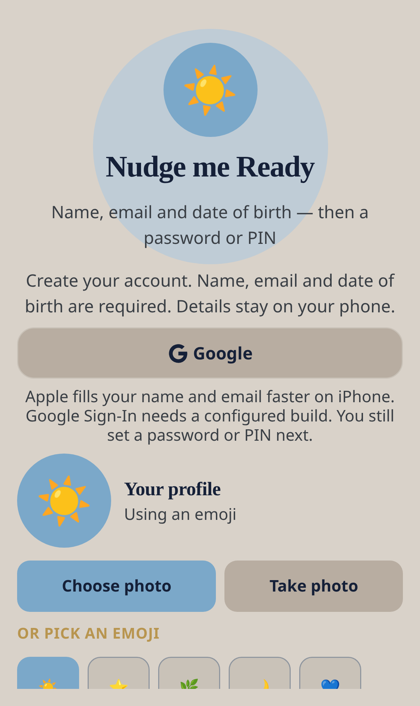

1. Install **Nudge me Ready v3** from TestFlight (not the older 0.2.0 app).
2. Create your **profile** (name, email, date of birth, photo or emoji).
3. Accept **Terms of Use**.
4. Optionally turn on **app lock** (Face ID and/or PIN / password). You can skip and do this later in Settings.
5. If a **recovery code** is shown, save it offline (paper or a password manager).

Then tap **See my day** to open Home.

v2 and v3 can both sit on the same iPhone. Data is **not** shared.

---

## 2. Find your way

| Tab | What it’s for |
| --- | --- |
| **Home** | What’s coming up, next action, Ready4 packs |
| **Nudges** | Open list — Later, Sorted, Smaller, Ask |
| **Add** | Say it, six everyday paths, or Something else |
| **Menu** | Crew, My money, timeline, Reward Bank, Ready4Packs, Settings |
| **Focus** | One thing at a time, with a smaller step if it’s hard |

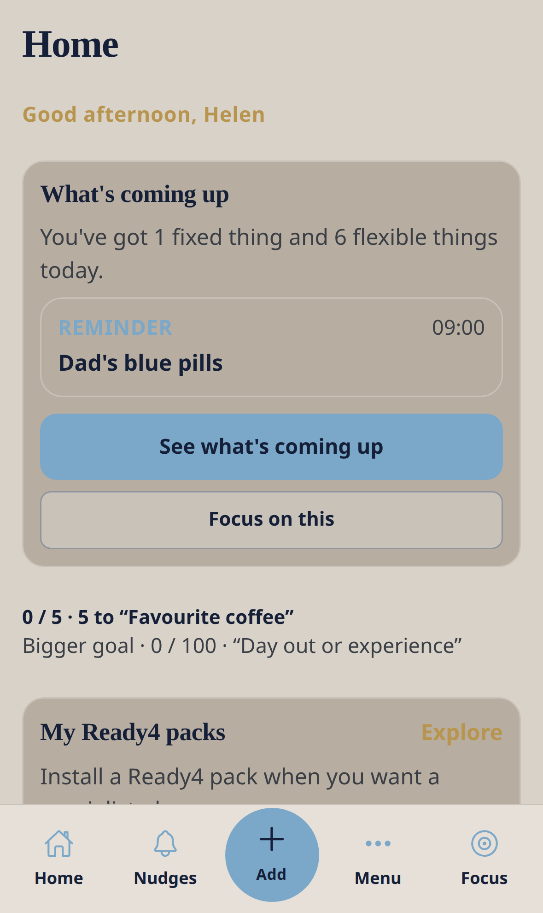

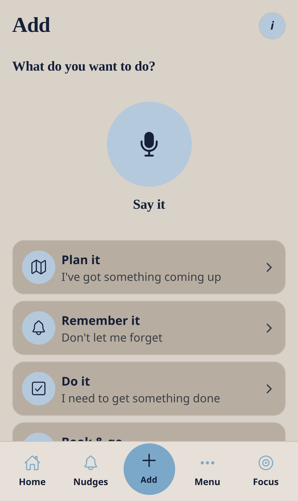

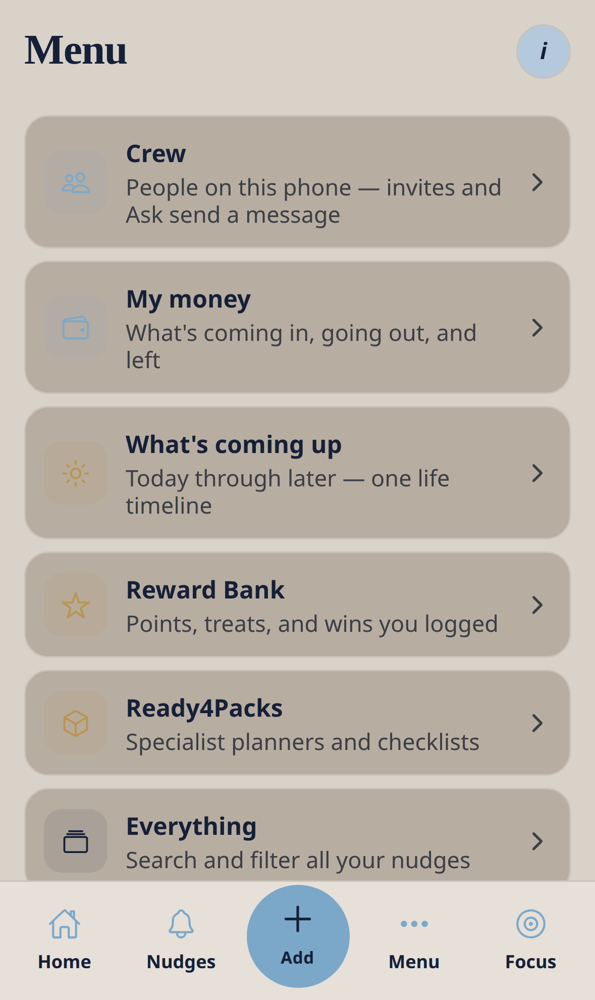

---

## 3. Add something you don’t want to forget

Everyday paths work with **no Ready4 pack**.

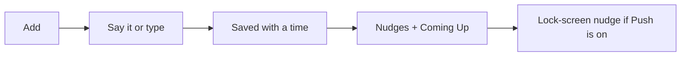

### Say it

1. Tap **Add** → **Say it**.
2. Speak naturally: “remind me to take the bins out tomorrow evening”.
3. If you said what and when, it saves straight away.
4. The first save may ask to turn on quiet phone reminders.

### Six paths

| Path | When |
| --- | --- |
| Plan it | Something is coming up |
| Remember it | Don’t let me forget |
| Do it | Get something done (optional drink / meal / move lists) |
| Book & go | Somewhere to be |
| Buy & pay | Buy, pay, or renew |
| Life & people | People and celebrations |

**+ Something else** is for anything that doesn’t fit. Every item stays editable:

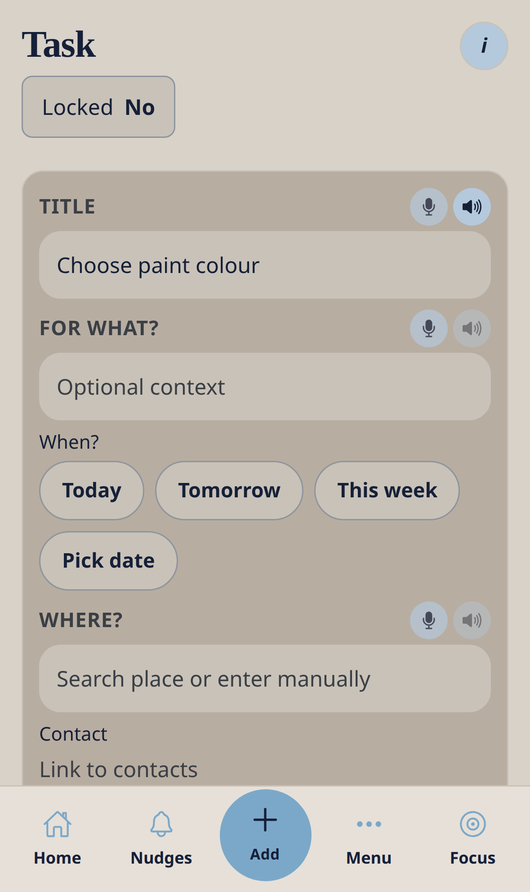

---

## 4. Act from the list

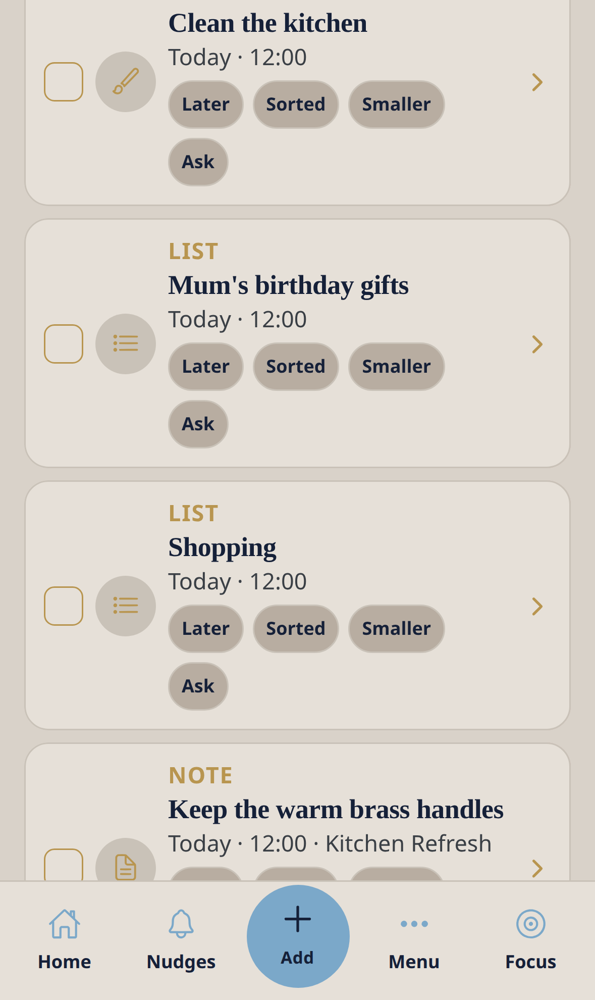

| Chip | What it does |
| --- | --- |
| **Later** | Moves it to tomorrow — allowed, no penalty |
| **Sorted** | Done, and can add a small Reward Bank point |
| **Smaller** | A tinier first step when it feels like too much |
| **Ask** | Opens Ask for help about that item |

There is no “failed streak”. Skip, snooze, and hard days are part of the design.

---

## 5. Home and What’s coming up

Home leads with the next real thing, then **See what’s coming up** for today / this week / later.

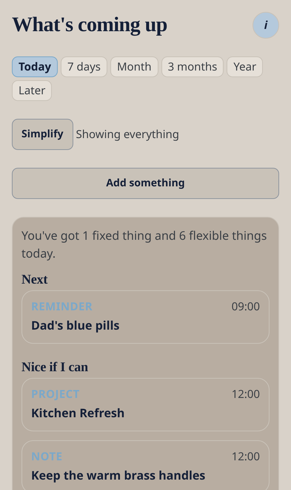

**Show my appointments here** (when offered) pulls phone calendar events onto the same timeline. Holidays and similar noise are skipped.

---

## 6. Focus

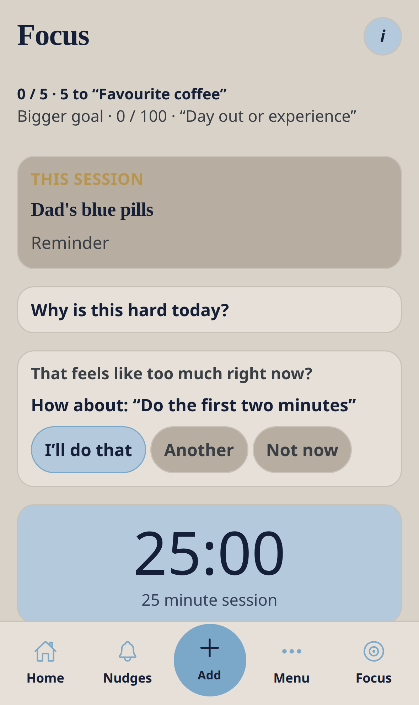

Open **Focus**, take a smaller step if offered, start a calm timed session. Pause or stop whenever you need.

---

## 7. Reward Bank

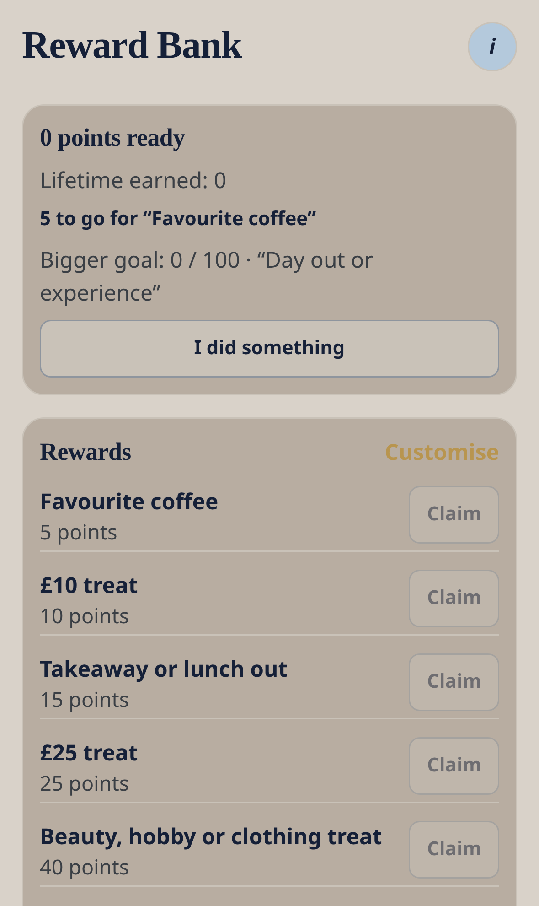

One bank. Small points. Claim Favourite coffee, a £10 treat, or rename treats. Progress over perfection.

---

## 8. Ready4Packs

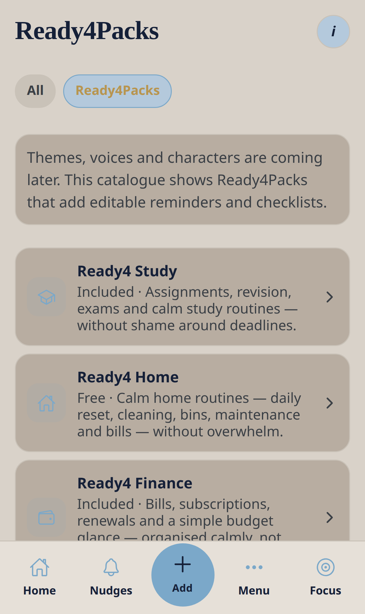

Packs add templates into the same six paths. They are not separate apps. Pack-specific choices only appear after install.

Health-related organisation (medication, emergencies, and similar) is **not medical advice**.

On TestFlight, if billing is off, the app says you will **not be charged**.

---

## 9. Crew and Ask

Crew lives **on this phone**. Invites and Ask send a message you share yourself. The other person does **not** see your list live yet.

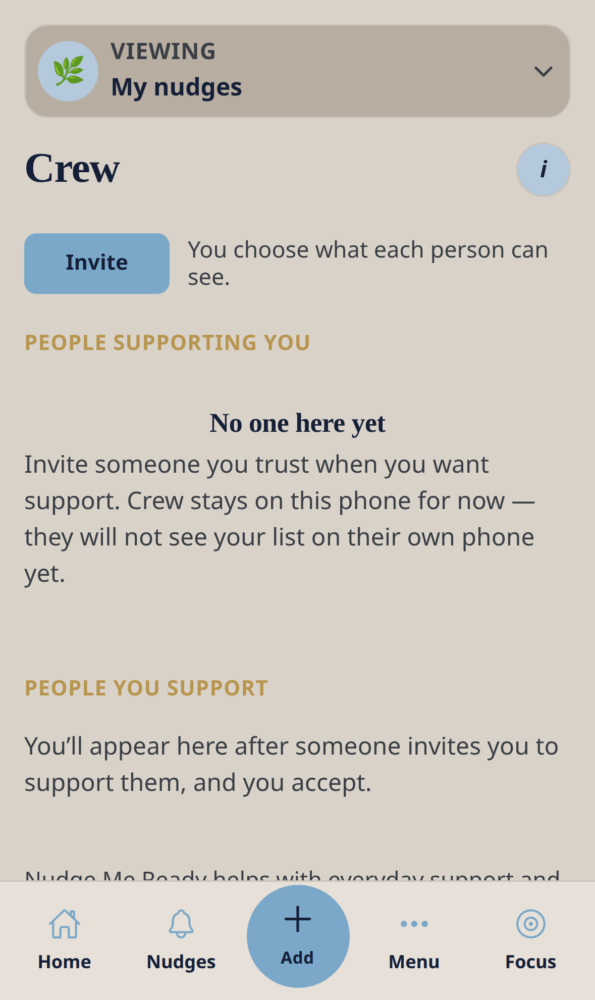

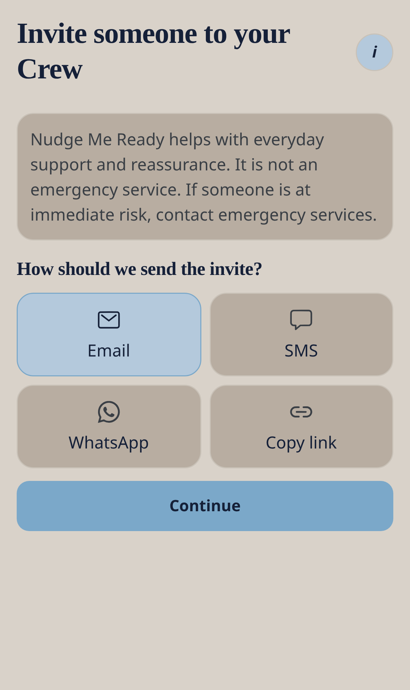

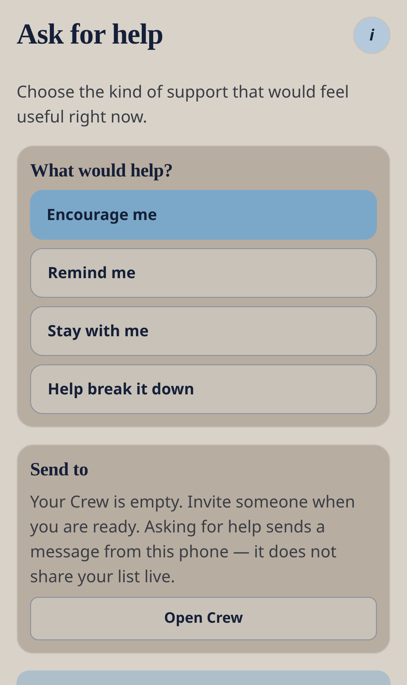

**Menu → Crew → Invite**. From a Nudges row, **Ask** can mention that item.

Nudge me Ready is everyday support, not an emergency service.

---

## 10. Settings checklist

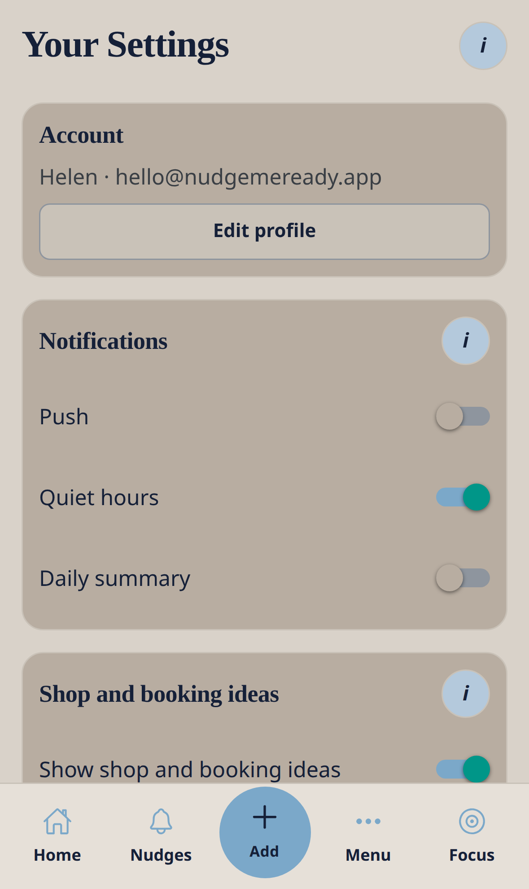

| Setting | Why |
| --- | --- |
| Push | Timed lock-screen nudges for dated open items |
| Quiet hours | Rest without interruption |
| Daily summary | Morning ping names today’s real titles |
| Security | App lock, recovery email, recovery code |
| This is home | Optional leaving-home checklist |
| Voice | Speak / hear / spoken reminders |
| Contacts & calendars | Guests and Show my appointments here |

Forgetting PIN/password resets the lock — it does **not** delete nudges. Uninstalling the app does.

---

## 11. My money

**Menu → My money** works with no pack: what’s coming in, going out, and left. Ready4 project budgets only appear when that pack is installed.

---

## 12. Troubleshooting

| Issue | Try |
| --- | --- |
| Reminders don’t fire | TestFlight v3 app; iOS Notifications; in-app Push; check Quiet hours |
| Face ID / voice / calendar missing | Full TestFlight install, not Expo Go / web |
| Still on the old app | Open **Nudge me Ready v3**, not the 0.2.0 icon |
| Data gone after reinstall | Local-only storage — expected |
| Need help | support@nudgemeready.app · https://nudgemeready.app/support/ |

---

## Recapture screenshots

From the project root (web preview):

```bash
CI=1 APP_VARIANT=v3 npm run screenshots
```

Images are written to `website/manual/images/guide-*.png`.
