# Nudge Me Ready — Process Flows

Operational flows for product, support and engineering. Diagrams use Mermaid.

---

## 1. First-run registration and optional lock

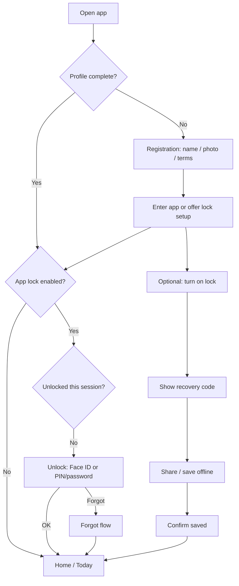

---

## 2. App lock and recovery

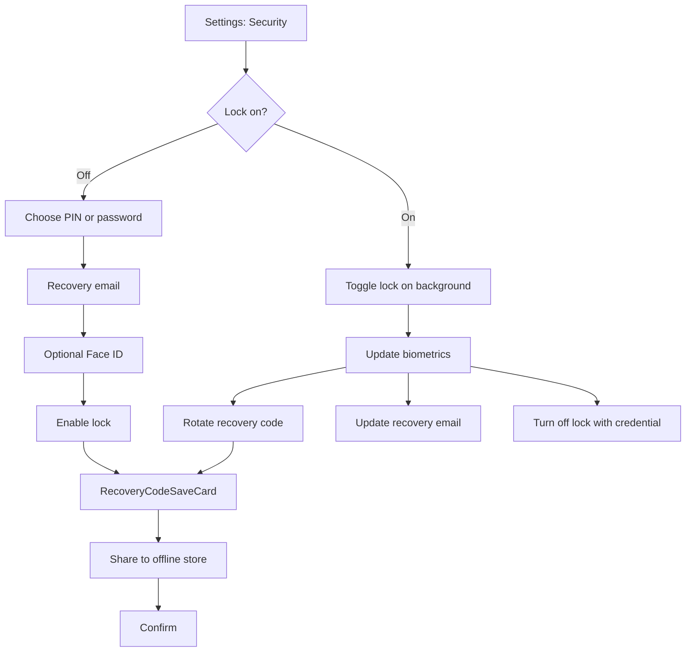

### Forgot credential

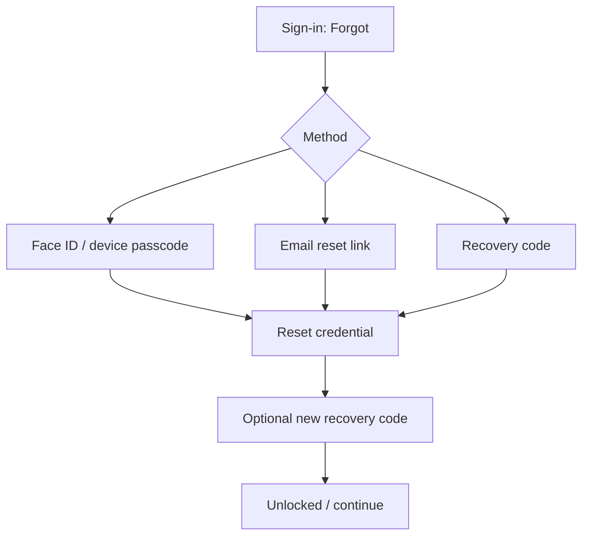

**Support line:** Device passcode + app lock + offline recovery code covers lost phones and casual snooping for this app class.

---

## 3. Create and complete a nudge

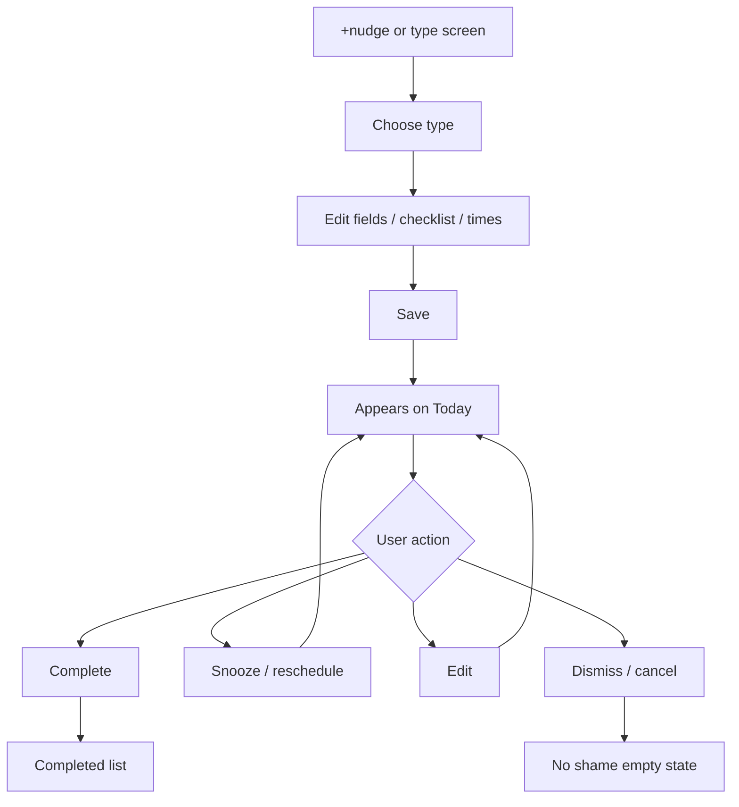

---

## 4. ReadyPack browse → install

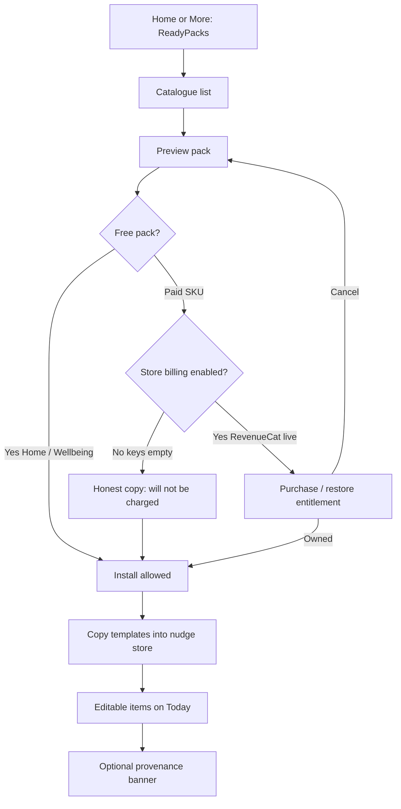

### Entitlement honesty

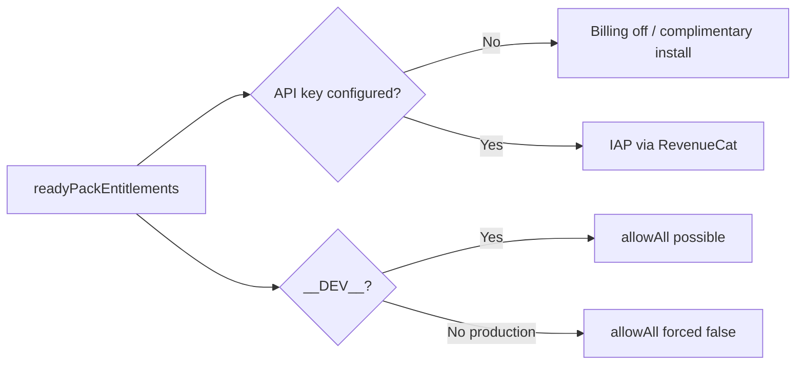

---

## 5. Crew invite and accept

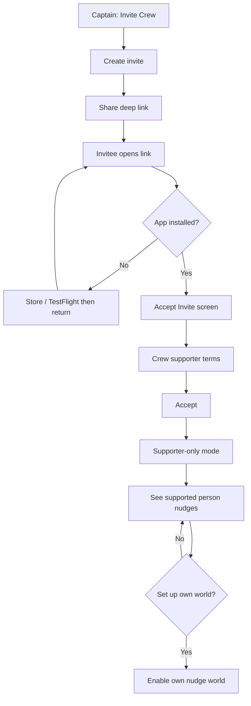

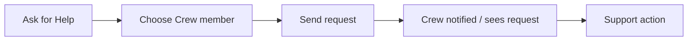

---

## 6. Appointment with guests and calendar

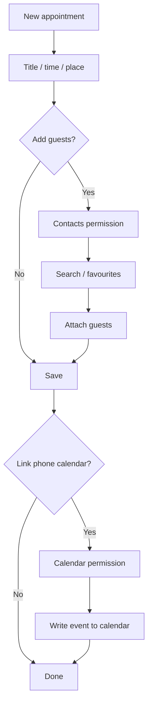

---

## 7. Travel pack shop links (affiliate-safe)

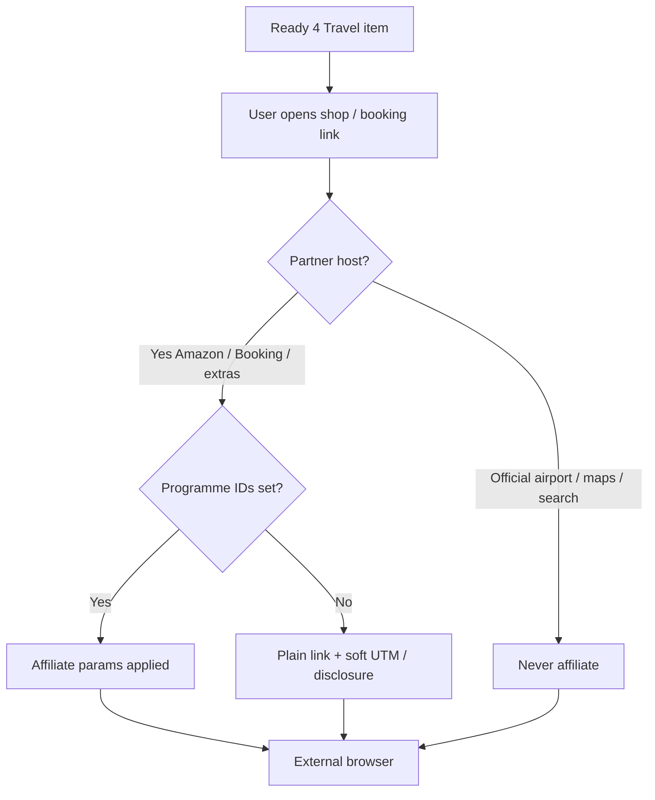

---

## 8. TestFlight release path

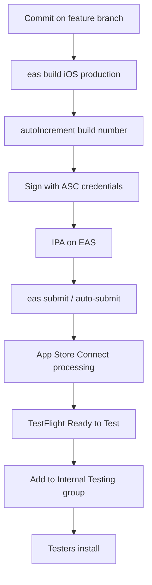

Current example: **0.2.0 build 13** (see Expo build dashboard).

---

## 9. Support triage flow

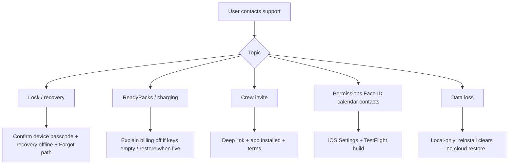

---

## 10. Content publishing (Ready 4)

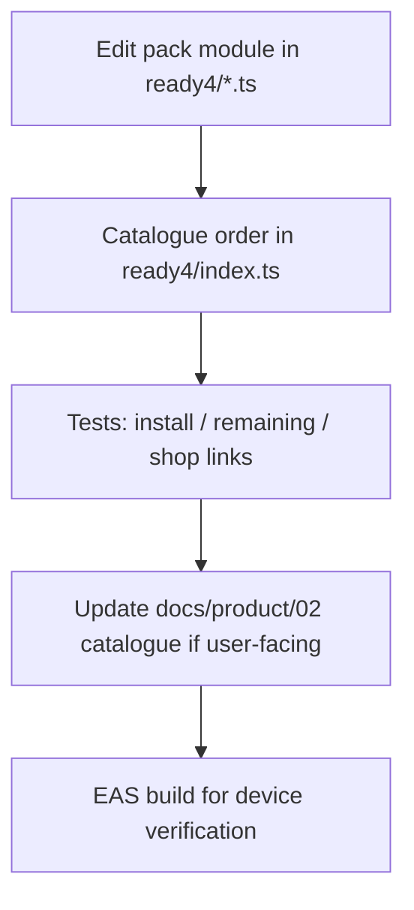

---

## Related documents

- [Product Spec Catalogue](./01-Product_Spec_Catalogue.md)  
- [Ready 4 Catalogue Edition 1](./02-Ready4_Catalogue_Edition_1.md)  
- [User Guides](./03-User_Guides.md)  
