# Ready4 Study — Template process flows

**Pack:** `ready4-study` · **Source:** `src/data/readyPacks/ready4/study.ts`  
**Install mapping:** `templateToItem()` in `src/services/readyPackInstall.ts`

This document shows, for every template: **what is captured**, **how the app treats it**, and **what the user does next**.

---

## 0. Pack-level journey (how the pieces fit)

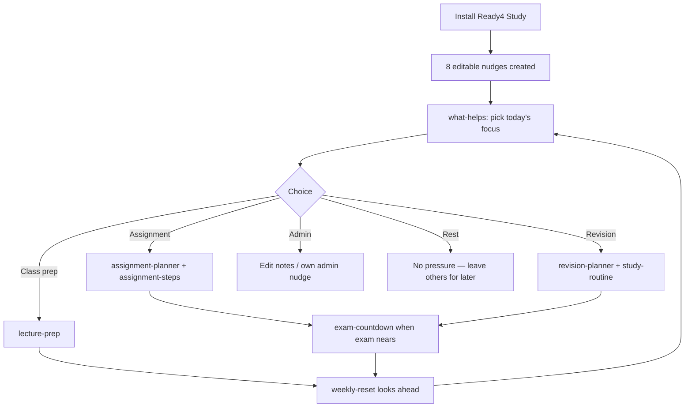

**Product intent:** Start with a kind daily choice (`what-helps`), then use planners/checklists as scaffolding. Nothing is locked; every field stays editable.

---

## 1. What install captures (system treatment)

On install, each template becomes a `NudgeItem` with:

| Template field | Becomes on nudge | Notes |
| --- | --- | --- |
| `title` | `title` | Shown on Today / details |
| `type` | `type` | `list` / `task` / `reminder` |
| `notes` | `notes` | Guidance copy |
| `listItems[]` | `listItems[]` status `open` | Tickable rows |
| `priority` | `priority` | Sorting / emphasis |
| `dueInDays` | `dueDate` = now + N days | Absolute ISO date at install |
| `reminderInDays` | `reminderDate` = now + N days | If set (Study pack does not use this today) |
| `repeatRule` | `repeatRule` | e.g. weekly |
| `speakingReminderText` | `speakingReminderText` | Spoken / TTS when used |
| — | `sourcePackId` = `ready4-study` | Provenance |
| — | `sourceTemplateId` | Template id |
| — | `userEdited` = `false` | Uninstall can remove unedited |

**User can always:** edit title/notes/dates/checklist · complete · snooze/reschedule · dismiss · tick list rows · ask Crew for help.

---

## 2. End-to-end state machine (any Study nudge)

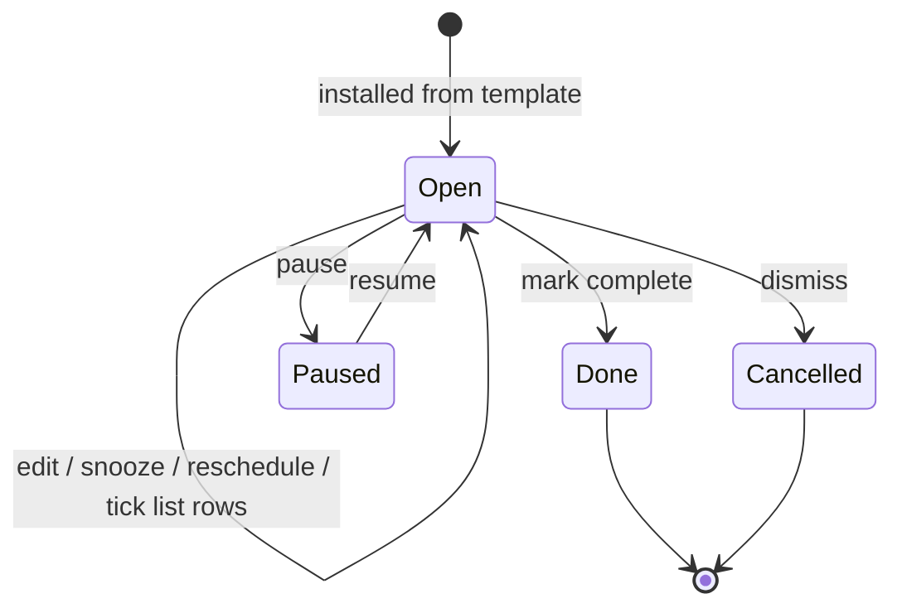

---

## 3. Per-template flows

### 3.1 `what-helps` — What would help today?

| | |
| --- | --- |
| **Type** | `list` |
| **Purpose** | Daily soft triage — pick **one** direction without shame |
| **Captured at install** | Title, notes, 5 open checklist rows (no due date, no priority, no repeat) |
| **Info the user adds later** | Which row they tick; optional edit of row text; may leave unticked |

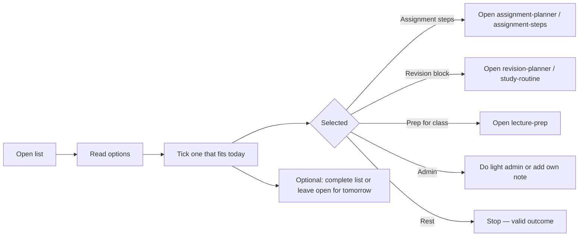

**Next action (product):** Use the choice as a pointer into the other Study nudges — not a gate. Rest is a first-class outcome.

---

### 3.2 `assignment-planner` — Assignment due soon

| | |
| --- | --- |
| **Type** | `task` |
| **Purpose** | One assignment card with a near due date |
| **Captured at install** | Title, notes, `priority: important`, `dueDate` = install + **7 days** |
| **Not captured** | Checklist (empty) — user breaks work into steps on the card / sibling list |
| **Info the user adds later** | Real due date, assignment name in title/notes, subtasks, attachments |

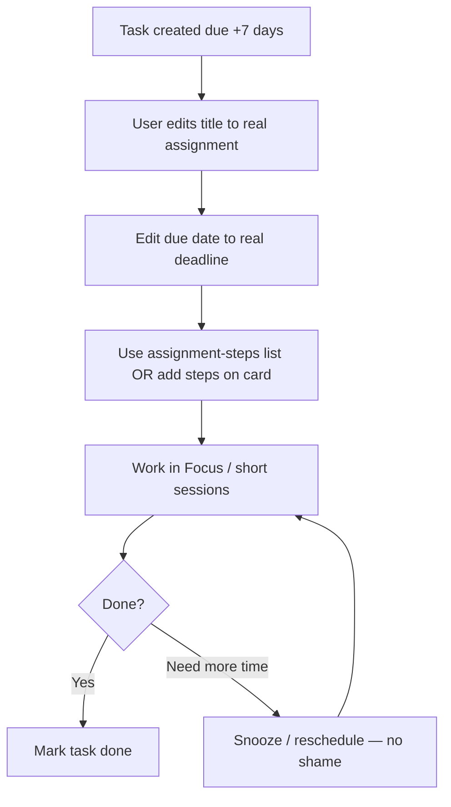

**Next action:** Rename + set real deadline → work via `assignment-steps` → complete or reschedule.

---

### 3.3 `assignment-steps` — Assignment tiny steps

| | |
| --- | --- |
| **Type** | `list` |
| **Purpose** | Micro-steps for one piece of coursework |
| **Captured at install** | Title + 5 open rows (brief → outline → source → help → submit) |
| **Info the user adds later** | Tick progress; rewrite steps; add/remove rows |

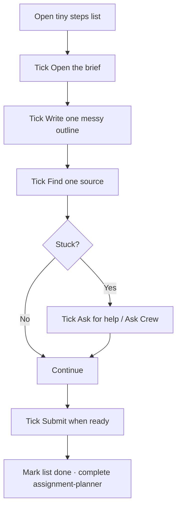

**Next action:** Work top-to-bottom (order suggested, not enforced) → optionally close sibling `assignment-planner`.

---

### 3.4 `revision-planner` — Revision topic list

| | |
| --- | --- |
| **Type** | `list` |
| **Purpose** | Short topic-focused revision sessions |
| **Captured at install** | Title, notes (“start tiny”), 4 rows (Topic 1/2, practice, break) |
| **Info the user adds later** | Real topic names; ticks; extra topics |

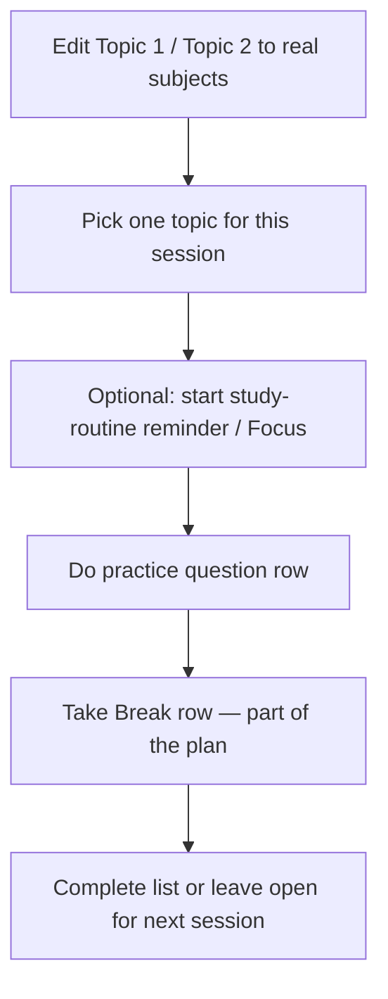

**Next action:** Personalise topics → one short session → break → repeat.

---

### 3.5 `exam-countdown` — Exam day checklist

| | |
| --- | --- |
| **Type** | `list` |
| **Purpose** | Practical exam-day readiness |
| **Captured at install** | Title, `priority: important`, `dueDate` = install + **3 days**, 5 checklist rows |
| **Info the user adds later** | Real exam date/time/room in notes; ticks |

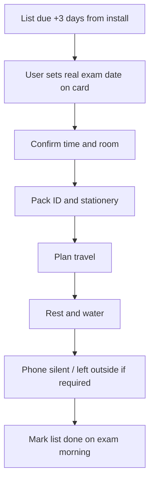

**Next action:** Align due date to real exam → tick logistics → done on the day.

---

### 3.6 `lecture-prep` — Class bag checklist

| | |
| --- | --- |
| **Type** | `list` |
| **Purpose** | Leave-for-class bag check |
| **Captured at install** | Title, notes (skip what you don’t need), 5 open rows |
| **No due / repeat** | Use ad hoc before class, or user can add a time |

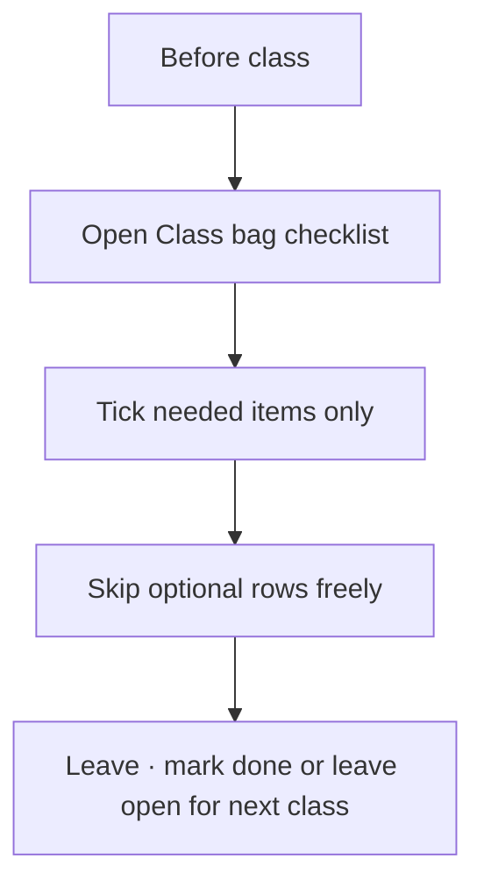

**Next action:** Quick scan before leaving → tick what’s relevant → go.

---

### 3.7 `study-routine` — Study routine block

| | |
| --- | --- |
| **Type** | `reminder` |
| **Purpose** | Soft cue to start a short focus window |
| **Captured at install** | Title, notes, `priority: soon`, speaking text *“Study time when you are ready.”* |
| **No due/repeat at install** | User sets when it should fire |
| **Info the user adds later** | Reminder date/time; optional repeat |

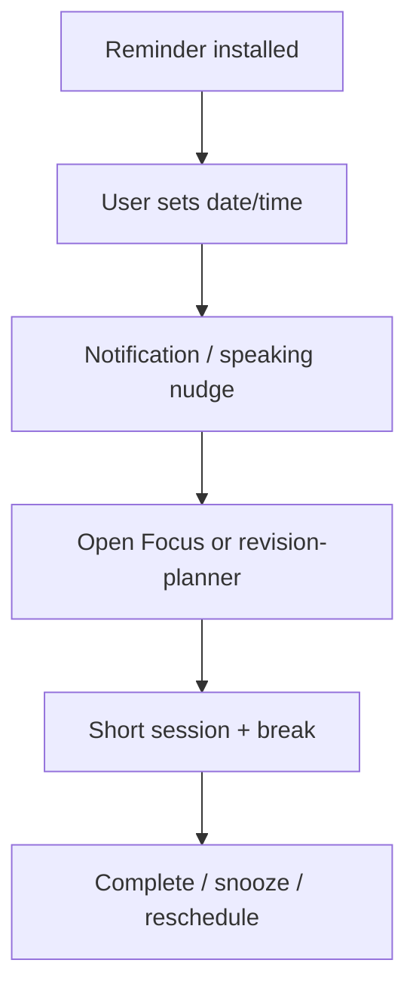

**Next action:** Schedule the reminder → when it fires, do a short block → break is expected.

---

### 3.8 `weekly-reset` — Week ahead glance

| | |
| --- | --- |
| **Type** | `list` |
| **Purpose** | Once-a-week calm lookahead |
| **Captured at install** | Title, notes, `repeatRule: weekly`, 4 open rows |
| **Info the user adds later** | What deadlines/classes matter this week; ticks |

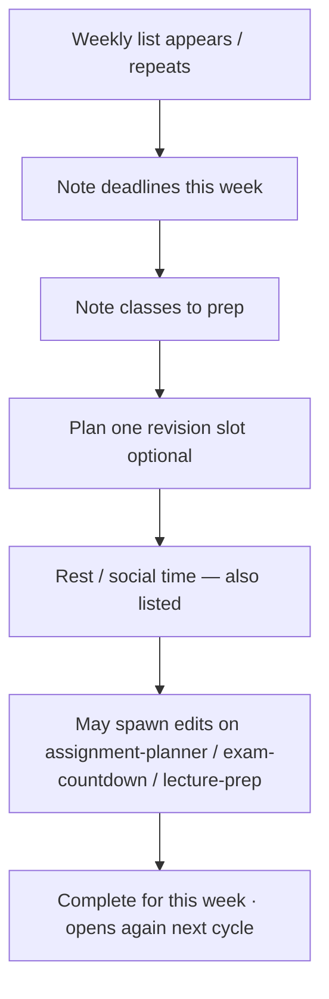

**Next action:** Glance → light planning → optionally update other Study nudges → close for the week.

---

## 4. Capture vs treatment summary matrix

| Template id | Type | Due | Priority | Repeat | Speaking | Checklist | Primary next action |
| --- | --- | --- | --- | --- | --- | --- | --- |
| `what-helps` | list | — | — | — | — | 5 choice rows | Pick one direction for today |
| `assignment-planner` | task | +7d | important | — | — | — | Set real deadline · break into steps |
| `assignment-steps` | list | — | — | — | — | 5 steps | Tick micro-steps → submit |
| `revision-planner` | list | — | — | — | — | 4 topics | Rename topics · one short session |
| `exam-countdown` | list | +3d | important | — | — | 5 logistics | Align to exam day · tick prep |
| `lecture-prep` | list | — | — | — | — | 5 bag items | Tick before class |
| `study-routine` | reminder | — | soon | — | Yes | — | Set time · Focus session |
| `weekly-reset` | list | — | — | weekly | — | 4 glance rows | Weekly plan → update other cards |

---

## 5. Suggested user path (happy day)

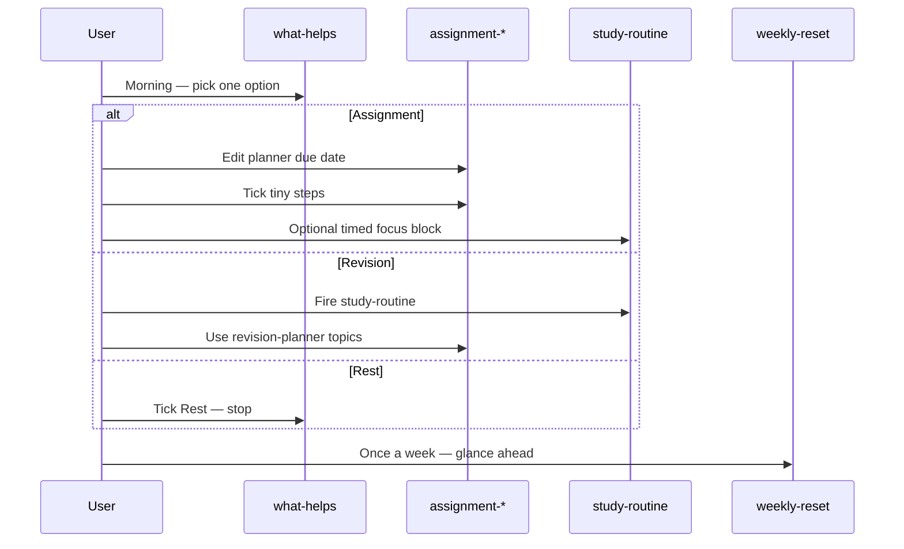

---

## 6. Related docs

- [Product spec — Ready4 Study](./01-study.md)
- [Ready4 catalogue](../02-Ready4_Catalogue_Edition_1.md)
- [Process flows (platform)](../04-Process_Flows.md)
- Spreadsheet export: `exports/ready4-templates-csv/ready4-study.csv`
